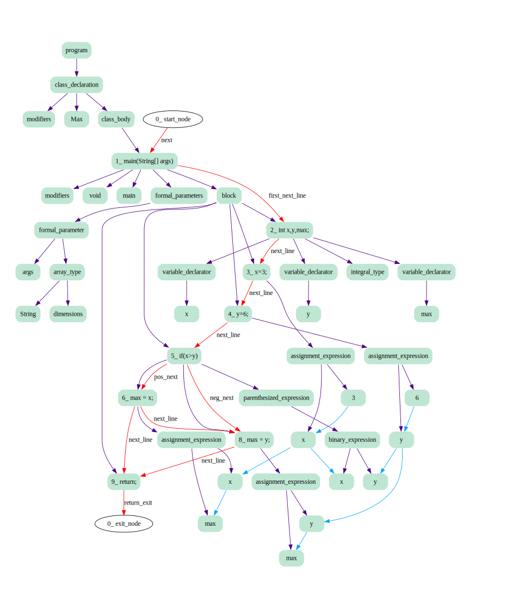

# Tree Sitter Mutli Codeview Generator
## OSCP Project

### Project Description
Efficient representation of source code is essential for various software engineering tasks using AI pipelines such as code translation, code search and code clone detection. Code Representation aims at extracting the both syntactic and semantic features of source code and representing them by a vector which can be readily used for the downstream tasks. Multiple works exist that attempt to encode the code as sequential data to easily leverage state of art NN models like transformers. But it leads to a loss of information. Graphs are a natural representation for the code but very few works(MVG-AAAI’22) have tried to represent the different code features obtained from different code views like Program Dependency Graph, Data Flow Graph etc. as a multi-view graph. In this work, we want to explore more code views and its relevance to different code tasks as well as leverage transformers model for the multi-code view graphs. We believe such a work will help to 
1. Establish influence of specific code views for the  common task 
2. Demonstrate how graphs can combined with transformers 
3. Create re-usable models

### Why is this repository interesting and useful?
This repository is designed to be used for research purposes - to generate combined multi-code view graphs that can be used with various types of machine learning models (sequence model neural networks, graph neural networks, etc). It is also designed to be easily extended to various source code languages. [tree-sitter](https://tree-sitter.github.io/tree-sitter/) is used for parsing which is highly efficient and has support for over 40+ languages. Currently, this repository supports codeviews for Java in over 40 possible combinations of codeviews. It has been structured such that support for other languages can be easily added. If you wish to add support for more languages, please refer to the [contributing](CONTRIBUTING.md) guide.


### Setup to run the code

1. For intial setup

You need to clone all the tree sitter repositories of the grammars of the languages. 
To do this, run the setup script in the root directory of the folder using the following command.
(This setup requires pip to be installed. If you wish to use a conda environment, you can also setup the environment using the ``environment.yml`` file in the root directory.)

``` bash setup.sh```

2. To generate a code view (AST, DFG, or CFG), follow the following steps

- In the ``config.json`` file, set the  the ``"combined": true``
- Save the source code in the ``code_test_files/`` directory, inside the appropriate subdirectory marked by the source language. Then enter the file in the ``file_name`` field in the ``config.json``
- Modify the ``"code_views"`` field according to what you want to generate.
- Run the command   ```python3 main.py```   in the home directory to generate code views.
- The output dot files and json files will be generated in the ``output_graphs`` and ``outout_json`` directories respectively, along with suitable names
- To make modifications to input and output preferences, refer to and modify the source code in `` main.py``  and ``codeviews/combined_graph/combined_driver.py`` respectively.

3. To visualize the generated files using GraphViz within VS Code, use this [extension](https://marketplace.visualstudio.com/items?itemName=tintinweb.graphviz-interactive-preview). 

**EXAMPLE CONFIG FILE** - 
To generate simple AST

```
{
    "src_language" : "java",
    "file_name" : "Graph.java",
    "combined" : true,
    "code_view" : "CFG",
    "graph_format" : "json",
    
    "combined_views" : {
        "DFG" : {
            "exists" : false,
            "collapsed" : false,
            "minimized" : false
        },
        "AST" : {
            "exists" : true,
            "collapsed" : false,
            "minimized" : false,
            "blacklisted" : ["expression_statement", "method_invocation"]

        },
        "CFG" : {
            "exists" : false,
            "collapsed" : false,
            "minimized" : false
        }
    }
}
```
To generate collapsed and combined AST and DFG

```
{
    "src_language" : "java",
    "file_name" : "Graph.java",
    "combined" : true,
    "code_view" : "CFG",
    "graph_format" : "json",
    
    "combined_views" : {
        "DFG" : {
            "exists" : true,
            "collapsed" : true,
            "minimized" : false
        },
        "AST" : {
            "exists" : true,
            "collapsed" : true,
            "minimized" : false,
            "blacklisted" : ["expression_statement", "method_invocation"]

        },
        "CFG" : {
            "exists" : false,
            "collapsed" : false,
            "minimized" : false
        }
    }
}
```
### Examples of generated graphs:

Combined simple AST+CFG+DFG for a simple Java program that finds Max: 
```
public class Max {
    public static void main (String[] args) {
        int x,y,max;
        x=3;
        y=6;
        if (x>y)
            max = x;
        else 
            max = y;

        return;
    }
}
```
- Violet edges - AST edges
- Blue edges - Data Flow edges
- Red edges - Control Flow edges




> Note: We use code snippets from [GraphCODEBERT](https://github.com/microsoft/CodeBERT/tree/master/GraphCodeBERT) for DFG generation, which is permitted under its MIT License. 

### Code Organization
The code is structured in the following way:
1. Input Files are placed in [code_test_files](code_test_files) directory grouped by language.
2. Output Files are placed in [output_graphs](output_graphs) and [output_json](output_json) directories.
3. For each code-view, first the source code is parsed using the tree-sitter parser and then the various code-views are generated. In the [tree_parser](tree_parser) directory, the Parser and ParserDriver is implemented with various funcitonalities commonly required by all code-views. Language-specific features are further developed in the language-specific parsers also placed in this directory.
4. The [codeviews](codeviews) directory contains the core logic for the various codeviews. Each codeview has a driver class and a codeview class, which is further inherited and extended by language in case of code-views that require language-specific implementation.
5. The [main.py](main.py) file is the driver for the codeview generation. It is responsible for parsing the source code and generating the codeviews.
6. The [config.json](config.json) file contains the configuration for the codeview generation.
> Note: The main original contributions of this repository are in the [codeviews](codeviews) and [tree-parser](tree-parser) directories. 

### Testing
To test the working of the repository, please check the [testing](testing) folder for test cases and testing scripts. You may modify the commands in the [run.sh](run.sh) script to run various testing scripts that will automatically run the systematically grouped test cases and compare them against the expected results and report if they passed or failed. 

#### Hardware and software requirements
The code in this repository was developed and tested on a machine with 32 GB RAM, Intel i7 processor and MacOS. However, this is not a sctrict requirement and any machine with 8GB or more RAM should perform quite efficiently. Any OS that can run Python and install the following dependencies can run this code.
The software dependencies are: 
- [tree-sitter](https://tree-sitter.github.io/tree-sitter/)
- [networkx](https://networkx.org/)
- [Graphviz-python](https://pypi.org/project/graphviz-python/)
